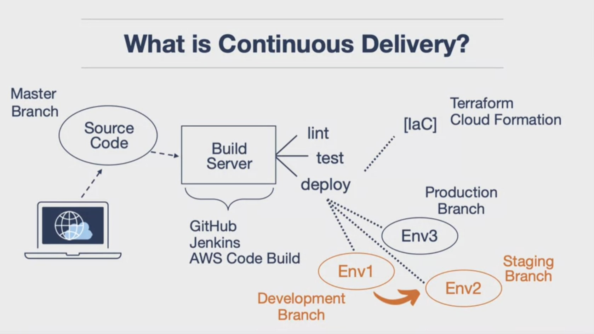

# gcp-app-engine
A continuous delivery pipeline to auto-deploy a Flask web application on Google App Engine.

<br>



1. Start or open a Google Cloud Platform project

2. Activate Cloud Shell 

3. Clone this GitHub repo, and cd into the directory:

```
git clone https://github.com/ptdriscoll/gcp-app-engine.git
cd gcp-app-engine
```

4. Create and source the Python virtual environment:

```
virtualenv ~/.gcp-app-engine
source ~/.gcp-app-engine/bin/activate
```

5. Install packages:

```
make all
```

6. To run locally: 

```
python main.py
```

7. To deploy the app (you'll need to select a region):

```
gcloud app deploy
```

8. Set up a continuous delivery trigger from GitHub to Cloud Build by following these instructions:

    - [Google Quickstart: Automate App Engine deployments with Cloud Build](https://cloud.google.com/source-repositories/docs/quickstart-triggering-builds-with-source-repositories)

### Video tutorials

- [GCP Google App Engine Continuous Delivery from Zero](https://www.coursera.org/lecture/cloud-computing-foundations-duke/gcp-google-app-engine-continuous-delivery-from-zero-7DFdK)
- [Setup Continuous Delivery on GCP Platform with Google App Engine and Cloud Build](https://www.youtube.com/watch?v=_TfWdOvQXwU)

### More references

- [Google App Engine and Cloud Build Continuous Delivery](https://paiml.com/docs/home/books/cloud-computing-for-data/chapter02-cloud-foundations/#google-app-engine-and-cloud-build-continuous-delivery)
- [GitHub: gcp-hello-ml](https://github.com/noahgift/gcp-hello-ml)
- [GitHub: gcp-flask-ml-deploy](https://github.com/noahgift/gcp-flask-ml-deploy)
- [GitHub: python-docs-samples/appengine/standard_python3/hello_world/](https://github.com/GoogleCloudPlatform/python-docs-samples/tree/master/appengine/standard_python3/hello_world)
- [Google Cloud Source Repositories documentation](https://cloud.google.com/source-repositories/docs)
